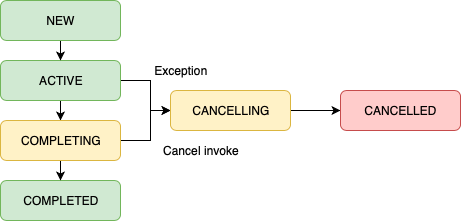

# 02. 코루틴 인 액션 & 03. 라이프 사이클과 에러 핸들링 

이번에 제가 발표를 맡은 2,3단원은 UI관련 자료가 많아서 사실상 내용이 많지 않았기 때문에 ^^,, 단원에 나온 코루틴 관련 개념들을 따로 조사해서 추가하였습니다. 
(지난주 발표와 조금 겹치는 부분이 있을 수도 있습니다)
참고한 문서로는 
- [코루틴 공식가이드 읽기](https://myungpyo.medium.com/%EC%BD%94%EB%A3%A8%ED%8B%B4-%EA%B3%B5%EC%8B%9D-%EA%B0%80%EC%9D%B4%EB%93%9C-%EC%9E%90%EC%84%B8%ED%9E%88-%EC%9D%BD%EA%B8%B0-part-5-62e886f7862d)

가 있습니다. 

## 코루틴
코루틴은 thread보다 비용이 적은 루틴이다. 해당 루틴을 생성, 정지, 취소, 완료하는 등 상태를 조절할 수 있다. 상태 조절을 통해서 
비교적 효율적으로 한정된 컴퓨터 자원을 사용할 수 있다는 장점이 있다. 

### Coroutine Context 
**모든 코루틴은 coroutine context 안에서 동작한다**
coroutine context는 아래의 interface를 구현한 객체이다. 

~~~kotlin
@SinceKotlin("1.3")
public interface CoroutineContext {
    /**
     * Returns the element with the given [key] from this context or `null`.
     */
    public operator fun <E : Element> get(key: Key<E>): E?

    public operator fun plus(context: CoroutineContext): CoroutineContext = 
            
    public fun minusKey(key: Key<*>): CoroutineContext

~~~

보면 plus 연산을 통해서 context를 누적시킬수가 있다. 

### 코드 톺아보기
아래처럼 우리가 아는 코루틴 빌더를 통해 코루틴을 만들어보고 현재 코루틴 컨텍스트를 찍어보는 코드를 보자 
~~~kotlin
fun main() {
   runBlocking<Unit> { println("My context is: $coroutineContext") }
}
// My context is: [BlockingCoroutine{Active}@5d3411d, BlockingEventLoop@2471cca7]
~~~

~~~kotlin
private class BlockingCoroutine<T>(
    parentContext: CoroutineContext,
    private val blockedThread: Thread,
    private val eventLoop: EventLoop?
) : AbstractCoroutine<T>(parentContext, true) {
~~~
코루틴에는 parentContext(=coroutineContext)와 blockingContext (runBlocking을 이용하였으므로), 그리고 eventLoop를 가지고 있다(이건 추후에 ...)

~~~kotlin
public abstract class AbstractCoroutine<in T>(
    /**
     * The context of the parent coroutine.
     */
    @JvmField
    protected val parentContext: CoroutineContext,
    active: Boolean = true
) : JobSupport(active), Job, Continuation<T>, CoroutineScope {
~~~

~~~kotlin
public interface CoroutineScope {
    /**
     * The context of this scope.
     * Context is encapsulated by the scope and used for implementation of coroutine builders that are extensions on the scope.
     * Accessing this property in general code is not recommended for any purposes except accessing the [Job] instance for advanced usages.
     *
     * By convention, should contain an instance of a [job][Job] to enforce structured concurrency.
     */
    public val coroutineContext: CoroutineContext
}
~~~
보면 coroutineScope라는 것은 CoroutineContext를 가지고 있다. 우리가 코루틴 빌더를 사용하면 coroutineScope가 생성이 된다. 

### CoroutineDispatcher

~~~kotlin
public abstract class CoroutineDispatcher :
    AbstractCoroutineContextElement(ContinuationInterceptor), ContinuationInterceptor {
    public abstract fun dispatch(context: CoroutineContext, block: Runnable)

}
~~~
dispatch라는 method가 있어 어떤 쓰레드에서 실행할 것인지를 구현할 수 있다. 

~~~kotlin
val netDispatcher = newSingleThreadContext(name="ServiceCall")
~~~

~~~kotlin
public fun newSingleThreadContext(name: String): ExecutorCoroutineDispatcher =
    newFixedThreadPoolContext(1, name)
~~~

~~~kotlin
internal class ExecutorCoroutineDispatcherImpl(override val executor: Executor) : ExecutorCoroutineDispatcher(), Delay {

    /*
     * Attempts to reflectively (to be Java 6 compatible) invoke
     * ScheduledThreadPoolExecutor.setRemoveOnCancelPolicy in order to cleanup
     * internal scheduler queue on cancellation.
     */
    init {
        removeFutureOnCancel(executor)
    }

    override fun dispatch(context: CoroutineContext, block: Runnable) {
        try {
            executor.execute(wrapTask(block))
        } catch (e: RejectedExecutionException) {
            unTrackTask()
            cancelJobOnRejection(context, e)
            Dispatchers.IO.dispatch(context, block)
        }
    }
~~~

#### async 코루틴 시작 
~~~kotlin
fun main() {

    runBlocking {
        val task = GlobalScope.async {
            doSomething()
        }
        task.join()
        println("Completed")
    }
}

fun doSomething() {
    throw UnsupportedOperationException("Can't do")
}
~~~
에러는 던져지지 않는다. 왜냐하면 async의 반환값은 deferred이기 때문이다. 결과를 확인해야 예외를 받을 수 있다. 
await을 호출하면 중단된다. 
join은 예외를 전파하지 않고 처리하고, await은 호출만으로도 예외가 전파된다. 

#### launch 코루틴 시작
결과를 반환하지 않는다. 위 코드를 그대로 적용시킬 경우 예외는 출력이 되지만 실행이 중단되거나 하진 않는다 (보통 서버쪽에서는 사용할일이 별로 없지 않을까?)

### Job
~~~kotlin
public interface Job : CoroutineContext.Element
~~~
job이라는것은 coroutine context를 뜻하는 것이다. 
> 코루틴 하나는 하나의 잡(Job) 으로 볼 수 있습니다. 잡은 코루틴의 라이프사이클, 취소, 그리고 부모-자식 관계를 책임집니다. 현재의 잡이 무엇인지는 현재 코루틴의 컨텍스트를 호출해서 확인할 수 있습니다.

